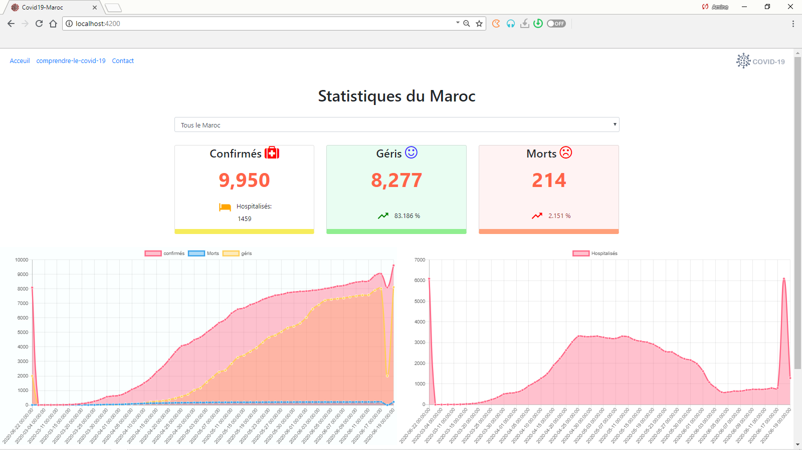
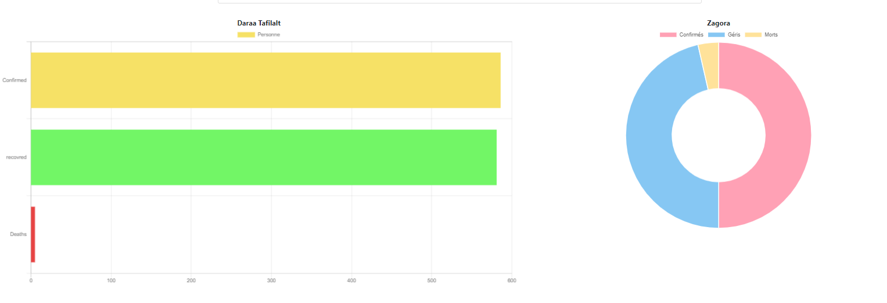

# COVID-19 TRACKER WITH LARAVEL(API),ANGULAR ,CHARTJS AND ORACLE DATABASE
This app fetch data stored by an admin in an oracle database using yajra/laravel-oci8 package which is an Oracle DB driver for Laravel 
the fetched datas displayed  by calling the API made by laravel in Angular and using chartsjs for the charts..
# Screenshots

